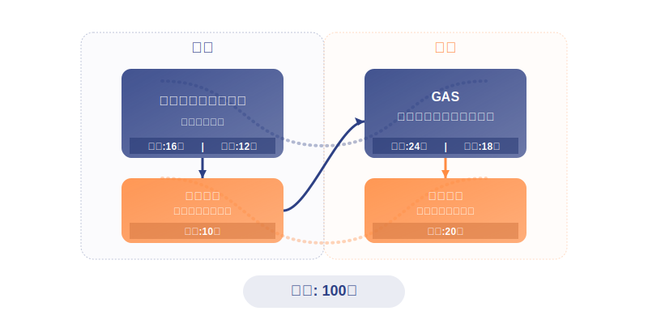
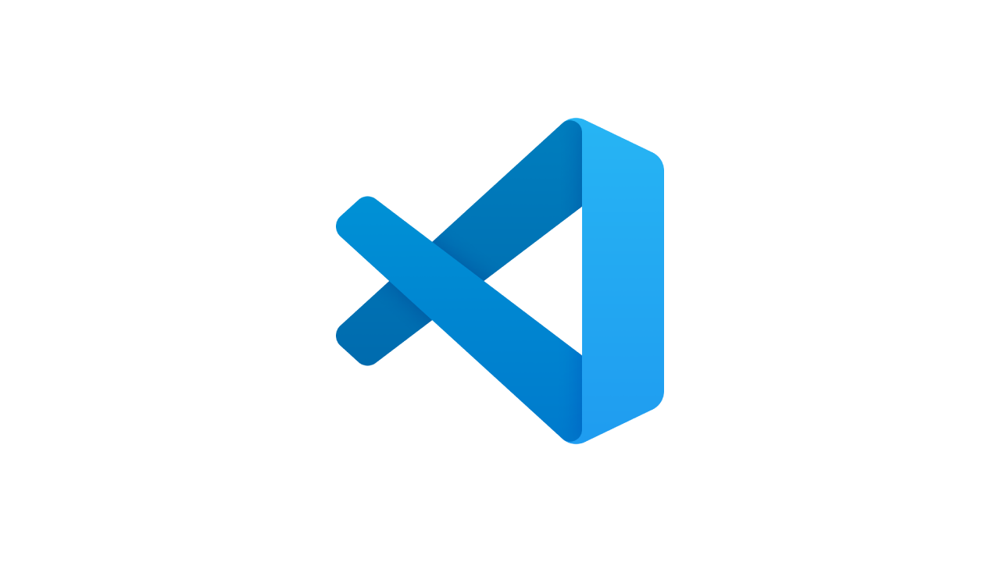

<!-- _class: heading-layout -->

#  アルゴリズム概論 2025・オリエンテーション {.font-bold .flex .items-center}


---

<!-- _class: split-layout -->

## 今日の流れ

:::
### 前半
- 講師自己紹介
- サポートメンバーのご紹介
- 講座のコンセプト
- 講義の構成
- 提出ルールについて
- 昨年との違いについて
  {.toc}
:::

:::
### 後半
- 環境設定
- プラグインのインストール
- VSCode の設定
- 配布素材の取り扱い方
- Live Server の設定
- HTML/CSS/JavaScript の体験
  {.toc}
:::


---
<!-- _class: heading-layout -->

# 講師自己紹介

---
<!-- _class: split-layout -->

## 講師自己紹介
:::

:::

:::
### コスゲタツヤ 
埼玉生まれ、神奈川の湘南在住。ベンチャー企業でエンジニアを行う傍ら、G's ACADEMY・大学や専門学校での講師業をしている。自身も積極的に学び続けており、講師側・生徒側双方で関わった教育現場は 26 にのぼる。

#### 経歴
- 音楽活動
- お好み焼き屋＋コールセンター
- 民間学校スタッフ
- フリーランス
- 現在
:::

---

<!-- _class: heading-layout -->

#  講座のコンセプト

---

<!-- _class: catchcopy-layout -->
## 講座のコンセプト
「複雑な課題を分解し、実現する問題解決力を身につける」

---

<!-- _class: eyecatch-content-layout -->

## 講座のコンセプト
::::eyecatch-box

::::

::::
### 民主的で創造的な世界を体感してもらう 
-  **困り事の発見** → **解決策の考案** → **実現**というプロセスから、創造性のある世界を体感。
-  豊かな発想をベースに論理的に問題・課題に対処する。

### 様々な力を養ってもらう 
-  課題を見つける力
-  解決策を考える力
-  **自分の手を動かして実現する力**

 **「私には無理だ」** から **「どうしたらできるだるう？」** へ！ {.notice-box}

::::

---

<!-- _class: heading-layout -->

#  講義の構成

---

<!-- _class: eyecatch-layout-->

## 講義の全体構成

:::

:::

---

<!-- _class: eyecatch-content-layout -->

## プログラミング基礎を用いた課題解決演習

:::eyecatch-box

:::

:::
### 1. 取り組む課題の確認 
提示された課題や問題を理解し、要件を整理します。

### 2. 解決策の検討と**ディスカッション** 
サポートメンバーのアドバイスも得ながら、多様な解決アプローチを考え、発表します。

### 3. 解決策の一例を使い、**手を動かしながら実装方法を学ぶ** 

プログラミングを用いた解決方法を学び、実践します

### 4. **オリジナル解決策**の実装 
2の解決策を実装して実現する。講師やサポートメンバーが一緒に考え、現実的に実現できる範囲への調整も含めてサポートします！
:::

---

<!-- _class: eyecatch-content-layout -->

## 中間演習

:::eyecatch-box

:::

:::
**前半で学んだ内容の復習と定着を図る**ための**演習時間**です。
**講義形式による新しい知識の習得は行わず**、 これまでの知識を活用した実践に集中します。

### 1. 学習内容の復習と統合
**前半の講義で学んだ内容の復習**も兼ねています。

### 2. 実践を通じた知識の定着
前半の講義で学んだ**課題解決プロセス**を再度体験してみます。

### 3. 後半の講義に向けた準備
演習の終盤で **Google Apps Script** 環境のセットアップを実施します。
:::

---

<!-- _class: eyecatch-content-layout -->

## GAS での効率化・自動化演習

::::eyecatch-box

::::

::::
前半で学んだプログラミング思考をベースに、Google Apps Script で**就職活動や社会人でも使えるスキル・考え方の獲得**を目指します。

### 1. より実務的な課題の提示
業務効率化やデータ処理など、今後役立ちそうな課題にも挑戦します。

### 2. 解決策の検討と**ディスカッション** 

サポートメンバーの力も得ながら、多様な解決アプローチを考え、発表しあいます。

### 3. **GAS** を用いた解決事例の学習と実装

### 4. **オリジナル解決策**の実装
実際に提出をしていきましょう。
::::

---

<!-- _class: heading-layout -->

# 補足

---

<!-- _class: eyecatch-content-layout -->

## 課題の提出ルールについて
::::eyecatch-box

::::

::::
### 基本ルール
-  各回の課題は**次回授業開始まで**が提出期限
-  提出方法や注意点、課題における細かい評価の基準は毎回の講義でお伝えします。
-  授業内にできるだけ基礎課題を終わらせるようにしましょう！

### 遅延提出について

期限後の提出は**減点対象**になることがあります。遅延は原則 **提出期限の 2 週間後** まで。

 やむを得ない事情がある場合は、**事前に相談**してください！！！ {.notice-box}

::::

---

<!-- _class: eyecatch-content-layout -->

## 昨年との違いについて
:::eyecatch-box

:::

:::
### **考えること**により重きを置いた構成に変更
プログラミングをこなすことに重きを置き過ぎた反省を踏まえ、難易度を調整し「考えを日本語で言語化する」ことにより重きを置いた構成にしました。

### **就職活動〜社会人でも活用できるスキル**を学ぶ機会を導入

後半の回で Google Apps Script を使い、より対応できるようにしました。

### **復習・追いつける機会**を設ける構成に

中間演習を導入、つまづいてもしっかりと追いつける構成を意識しました。
:::


---

<!-- _class: eyecatch-content-layout -->

## ポータルページをご用意しました！


::::eyecatch-box

::::


::::
:::
講義の情報を網羅したポータルページを用意しました！
過去の資料などもこちらから見返すことができます！
:::

:::


### ポータルページ

<a href="https://kansaigaidai2025.vercel.app/" target="_blank">https://kansaigaidai2025.vercel.app/</a>

:::

::::


---

<!-- _class: heading-layout -->

#  後半戦スタート！

---

<!-- _class: split-layout -->

## 必要なツールのダウンロード

:::center-box


### Google Chrome
<a href="https://www.google.com/intl/ja_jp/chrome/" target="_blank">https://www.google.com/intl/ja_jp/chrome/</a>
:::

:::center-box


### Visual Studio Code

<a href="https://code.visualstudio.com/" target="_blank">https://code.visualstudio.com/</a>

:::

---

<!-- _class: eyecatch-content-layout -->

## プラグインのインストール

:::eyecatch-box

:::

:::
プラグインは、**VScode に機能を追加**できる仕組みです！
まずは**日本語化のプラグイン**を使ってプラグインのインストール方法を学びましょう！

1. 入力欄に「**Japanese language Pack**」と入力。
2. 検索結果にプラグイン一覧が出てくるので、一番上にある「**Japanese language Pack**」を選択。
3. 画面中央部に「**インストール**」という青いボタンがあるので、ボタンを押す。
   _（※上記画像では「アンインストール」と表示されていますがこの部分を指します）_{.text-sm}
4. （場合により）**Visual Studio Code**の再起動を行う。
   {.order-list}

:::

---

<!-- _class: split-layout -->

## （演習）プラグインインストールのトレーニング

:::eyecatch-box

:::

:::
いくつかのプラグインをインストールするトレーニングをしていきましょう！

「**Japanese language Pack**」の時と同様、 以下 7 つのプラグインの名前を 1 つ 1 つ検索した上で、該当のプラグインを表示 → **インストール**するようにしてみてください！

- **・Path Autocomplete**
- **・IntelliCode**
- **・indent-rainbow**
- **・Auto Rename Tag**
- **・Highlight Matching Tag**
- **・zenkaku**
- **・Live Server**
:::

---

<!-- _class: split-layout -->

## VSCode の細かい設定を行う（Win）
:::eyecatch-box


:::

:::
**コードフォーマッター**を活用すると、コードの保存時にあっという間に自動でコードを整理整頓してくれます！
乱れたコードはプログラムが動かない原因になるので、**コードフォーマッター**を活用しましょう！

1. ファイルから**ユーザー設定**を選択
2. **設定**を選択
3. 書式設定を選択し **Format On Save** にチェック!
   {.order-list}
:::

---

<!-- _class: split-layout -->

## VSCode の細かい設定を行う（Mac）

:::center-box


:::

:::
**コードフォーマッター**を活用すると、コードの保存時にあっという間に自動でコードを整理整頓してくれます！
乱れたコードはプログラムが動かない原因になるので、**コードフォーマッター**を活用しましょう！

1. **基本設定**を選択
2. **設定**を選択
3. 書式設定を選択し **Format On Save** にチェック!
   {.order-list}
:::

---

<!-- _class: split-layout -->

## 自動保存の設定

:::center-box

:::

:::
プログラムはコードを書くたびにファイル保存をする必要がありますが、プログラミングに慣れないうちは**保存を忘れてしまうことがよくあります・・・**

なので今回は Visual Studio Code に**自動でファイル保存**をしてもらうように設定します！
:::

---

<!-- _class: split-layout -->

## その他の設定をいじる

:::center-box

:::

:::
**基本設定** → **設定**から

-  **Wrap Tabs** を検索 → チェック入れる
-  **Mouse Wheel Zoom** を検索 → チェック入れる
-  **Editor : smoothScrolling** を検索 → チェック入れる
:::

---

<!-- _class: heading-layout -->

#  演習

---

<!-- _class: eyecatch-content-layout -->

## 困ったときのお問い合わせ先を知ろう

:::eyecatch-box

:::

:::
**講師にメールを送りましょう！**

-  **Outlook** を開く
-  **名前** を本文に入れる
-  **f001547@kansaigaidai.jp** にメールをする
:::

---

<!-- _class: eyecatch-content-layout -->

## 配布素材を読み込みしてみよう

:::eyecatch-box

:::

:::
毎回の講義前には、以下の準備が発生します！

-  **講師**：講義で使用する素材を配布
-  **皆さん**：配布された素材をダウンロードし、素材を解凍・展開して VSCode で読み込みする

毎回やる操作になるので、慣れるために今のうちに練習をしましょう！
:::

---

<!-- _class: three-column-layout -->

## Windows で配布素材を読み込みしよう

::::card-box

)
1・ダウンロードした配布の場所を確認

)
2・ファイルを右クリックし
「すべて展開」を選択。

)
3・展開を選択。

::::

 展開した素材を Visual Studio Code にドラッグアンドドロップすれば読み込み完了です！ {.notice-box}

---

<!-- _class: three-column-section -->

## Macで配布素材を読み込みしよう

::::card-box
{.text-center}
1・ダウンロードした配布フォルダをダブルクリック

{.text-center}
2・ 同じ場所に同名のデータ（ **.zip** がついていない）ができるのを確認。


3・2 で展開されたフォルダを **`Visual Studio Code`** にドラッグアンドドロップする。

::::

 展開した素材を Visual Studio Code にドラッグアンドドロップすれば読み込み完了です！ {.notice-box}

---

<!-- _class: three-column-layout -->

## Live Serverで規定ブラウザをChromeにしよう

::::card-box
:::
{.text-center}
1・設定を開き「**Custom Browser**」で検索
:::

:::

2・Live Server -> Custom Browser の設定を「**Chrome**」にする
:::

:::

3・ VSCode の右下あたりにある「**Go Live**」を選択
:::
::::

 現在選択しているファイルを Google Chrome 上に表示させることができれば完了です！設定メニューの開き方も覚えておきましょう！ {.notice-box}

---

<!-- _class: eyecatch-content-layout -->

## 課題提出の練習をしよう

:::eyecatch-box

:::

:::
課題提出用のフォームをご用意しました！

-  **https://kansaigaidai2025.vercel.app/submit**

Zip にしたデータを提出フォームから送付してみましょう！データは重すぎないように注意です！
:::

---


<!-- _class: heading-layout -->

#  エディタに触れてみる

---

<!-- _class: content-layout -->

## HTML・CSS・JavaScriptの体験をする

:::
以下のコードを指示に従い 1 つずつ貼り付けていきましょう！{.text-center}
:::

:::code-box
HTML {.code-label}

```html
<div id="room" style="width: 100vw; height: 100vh;"></div>
<button id="switch">電気をつける</button>
```
:::

:::code-box
CSS {.code-label}

```CSS
.on{
    background-color: #fff;
}
.off{
    background-color: #000;
}
```
:::


---

<!-- _class: content-layout -->

## HTML・CSS・JavaScriptの体験をする

:::code-box
JavaScript {.code-label}
```JavaScript
let isLightOn = false; // 電気の状態を表す変数
const switchBtn = document.querySelector('#switch')
const room = document.querySelector('#room');

switchBtn.addEventListener('click', function() {
    if (isLightOn) {
      switchBtn.innerHTML = '電気を消す'
      room.classList.remove('on');
      room.classList.add('off');
    } else {
      switchBtn.innerHTML = '電気をつける'
      room.classList.add('on');
      room.classList.remove('off');
    }
    isLightOn = !isLightOn; // 状態を反転させる
});
```
:::

---

<!-- _class: eyecatch-content-layout -->

## 演習：HTMLとCSSとJavaScriptの違いを言語化する

::::

::::

::::
-  HTML
-  CSS
-  JavaScript
  はそれぞれどんな役割を表していると言えるでしょうか！？

考えて、**「日本語で」** 言語化をしてみましょう！


1 個 1 個コードを貼り付けをしながら、ブラウザに表示されるものの変化を確認してみよう {.notice-box}

::::

---

<!-- _class: centering-layout -->

## プログラミングやAIとは何か？

:::
### 「人間がやりたいことをコンピューターに伝えるための手段」{.text-catchcopy}
-  プログラミングは **「コンピューターが理解できる言葉」**
-  AI は「**人間の言葉でもコンピューターが内容をより理解できる**ようになるためのもの」
:::

---

<!-- _class: centering-layout -->

## プログラミングやAIを使いこなすには...？

::::
:::
-  私たち人間がやりたいことを **「しっかりと言語化できる」** 必要がある
-  コンピューターや AI がわかりやすい表現ができるようになると「**より伝わる**」
:::


 {.text-center}


講義の中では「言語化トレーニング」もやっていきます！{.text-catchcopy}

::::

---

<!-- _class: heading-layout -->


#  オリエンテーションおしまい！


---
